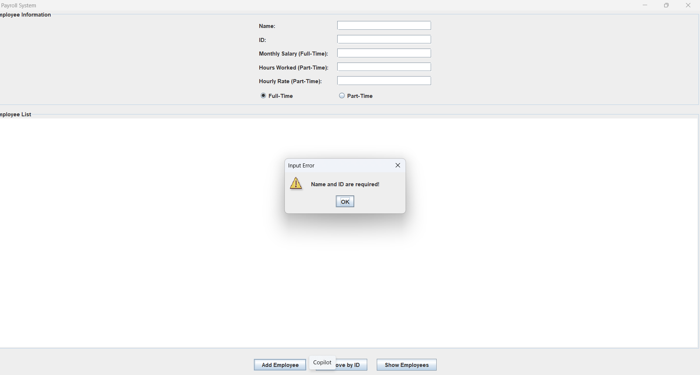
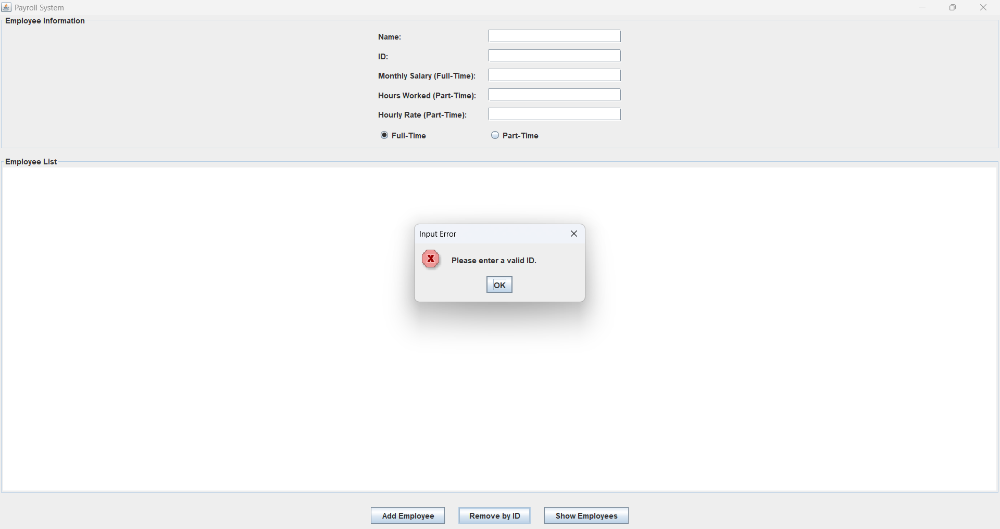
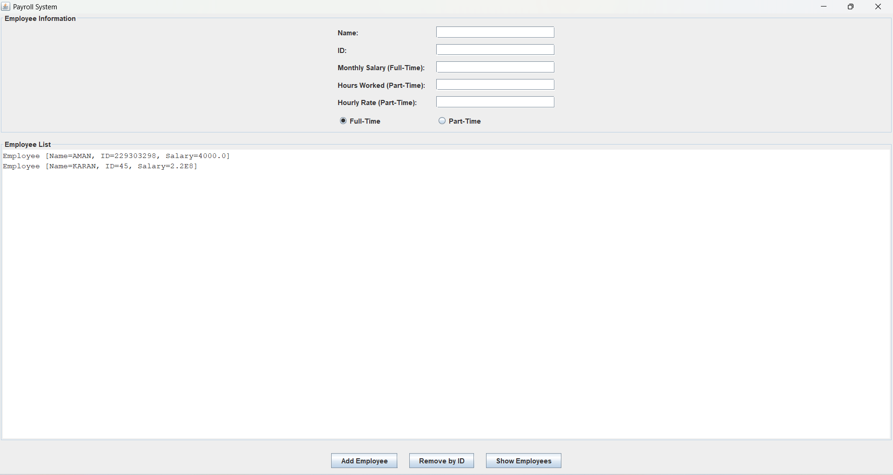

# 🧾 Java Payroll Management System

This Java project demonstrates a simple Payroll System that effectively implements core **Object-Oriented Programming (OOP)** principles.

---

## 🔧 OOP Concepts Implemented

### 1️⃣ Abstraction
- The abstract class `Employee` defines common structure (`name`, `id`, and `calculateSalary()` method) for all employee types.
- Hides implementation details and enforces subclasses to define salary logic.

### 2️⃣ Inheritance
- `FullTimeEmployee` and `PartTimeEmployee` **extend** the abstract class `Employee`.
- Inherits common fields like name and ID.

### 3️⃣ Polymorphism
- Each employee type overrides `calculateSalary()` differently:
  - `FullTimeEmployee`: returns monthly salary.
  - `PartTimeEmployee`: returns hourlyRate × hoursWorked.
- Enables dynamic method execution at runtime.

### 4️⃣ Encapsulation
- All fields (`name`, `id`, etc.) are `private`.
- Accessed using public `getName()` and `getId()` methods.
- Ensures data safety and object-level control.

---

## 📸 Screenshots

### 🔹 Form for ADD Employee section (Add Employee Form):

### 🔹 Input Validation (Missing Name/ID Alert):

### 🔹 Displaying Employee List (After Adding):

---

## 👨‍💻 Author

**Aman Sharma**  

📅 Last Updated: August 06, 2025

